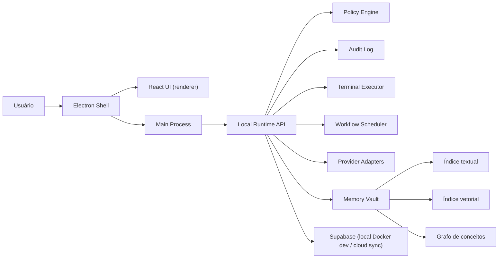

# ARCHITECTURE.md — rrb-jarvisOS

Fonte de decisão: `docs/DECISIONS.md`. Requisitos completos: `docs/iniciais/requisitos-agent-os.md`. Plano técnico detalhado por fases: `docs/iniciais/plano-implementacao-agent-os.md`. Este arquivo é o resumo operacional — se conflitar com um ADR, o ADR vence.

## Tese

Desktop app **local-first** (ADR-001): execução, memória de trabalho e estado operam no dispositivo e funcionam offline nos fluxos essenciais. Supabase Cloud é espelho de sync, auth e auditoria — reconstruível a partir dele, mas nunca pré-requisito para operar. Agentes rodam enquanto o app está ativo (inclusive em tray); não sobrevivem a logout/reboot.

O erro mais provável do projeto é integrar tudo ao mesmo tempo. A ordem defensável: shell → modelo de dados → permissões/auditoria → execução allowlisted → provedores externos → voz.

## Desenho



## Módulos

| Módulo | Responsabilidade | Regra crítica |
|---|---|---|
| **Electron Shell** | Janela, tray, IPC, ponte segura UI↔runtime | Renderer sem Node; IPC mínimo e tipado via preload |
| **React UI** | Telas dos espaços NOA/JARVIS OS e do Agentic OS | Consome contratos, nunca objetos soltos; módulos plugáveis |
| **Local Runtime API** | Domínio, comandos, auditoria, orçamento, execução | Camada de domínio independente do Electron |
| **Policy Engine** | Classificar risco (baixo/médio/alto/bloqueado), orçamento, allowlist, aprovação humana | **Fail closed**; toda decisão gera `AuditEvent` |
| **Terminal Executor** | Comandos reais pós-validação | Allowlist, cwd permitido, timeout, sem admin no MVP |
| **Provider Adapters** | OpenAI, Claude (API + Code CLI), Gemini, Google Workspace, ElevenLabs, Ollama | BudgetPolicy **antes** da chamada; custo/latência medidos |
| **Memory & Knowledge** | Ingestão, índices textual/vetorial/grafo, RAG rastreável | RLS herdada da fonte em todo índice; `inferred` ≠ `confirmed`; exclusão remove de todos os índices |
| **Voice Layer** | STT/TTS online no MVP; offline como evolução | Entra depois do Command Center textual; mesma política de aprovação |
| **Supabase** | Dev: metadados/RLS/migrações. Prod: espelho sync/auth/auditoria | Local é fonte de verdade operacional |

## Dados

- Espaços: `noa` (pessoal) e `jarvis` (profissional). **`Desenvolvimento` é plataforma, não workspace. `Agentic OS` é área interna do JARVIS OS, nunca um quarto workspace** — usa o `workspace_id` do JARVIS OS.
- Toda entidade persistida carrega os campos de escopo do `docs/CONVENTION.md` (`user_id`, `workspace_id`, e quando aplicável `organization_id`, `visibility`, `sensitivity`).
- Isolamento: NOA privado por padrão; JARVIS OS nunca acessa `personal`/`financial`/`health` sem aprovação explícita; compartilhamento NOA↔JARVIS bloqueado no MVP.
- Entidades da fundação: `UserProfile`, `Workspace`, `Session`, `AuditEvent`. Modelo completo (Agent, Squad, Skill, Workflow, Memory*, etc.) em `docs/iniciais/requisitos-agent-os.md` § Modelo de Informação.
- `AuditEvent` é imutável e append-only desde a primeira fatia.

## Fronteiras de segurança

1. Renderer nunca executa comando, nunca lê segredo, nunca acessa Node.
2. Main process não decide política sozinho — chama o Policy Engine.
3. Runtime registra auditoria antes e depois de ação sensível.
4. Toda integração externa passa por adapter; credencial vive em vault/env, nunca em UI ou log.
5. Segredos ausentes aparecem como `missing`, sem revelar valor.

## Resiliência

- **Offline**: fluxos essenciais operam sem internet; sessão auth cacheada localmente (duração: questão aberta do ADR-001, proposta em SPEC-Fundacao-03).
- **Fail closed**: ação não reconhecida pela política é bloqueada, não permitida.
- **Orçamento**: BudgetPolicy (padrão USD 1/dia e USD 1/mês) verificada antes de qualquer chamada paga; com BYOK é estimativa + alerta, não bloqueio garantido (custo aceito no ADR-001).
- **Serviços internos**: healthcheck por serviço; serviço crítico offline bloqueia automações dependentes e gera notificação + `AuditEvent`.
- **Execução**: timeout obrigatório, kill process, retry state em falha de workflow.
- **Sync**: estratégia de conflito multi-dispositivo ainda aberta (ADR-001, questão 3) — não implementar sync bidirecional antes de decidir.

## Dependências críticas (ordem que não pode inverter)

1. Policy Engine antes de terminal real.
2. `AuditEvent` antes de providers reais.
3. BudgetPolicy antes de qualquer chamada paga.
4. Modelo multiusuário antes de Supabase persistente.
5. Command Center textual antes de voz.
6. Execução manual antes de cron/autonomia.
7. RLS das fontes antes de índices de memória; proveniência antes de RAG para agentes.

## Stack

Electron · React · TypeScript · Vite · Vitest · Playwright · Tailwind (+ Radix ad-hoc) · Supabase (dev na nuvem para OAuth — ADR-002; Docker local na fase de persistência) · SQLite local (proposta SPEC-Fundacao-04).

Estrutura de diretórios: `src/main/` (electron, ipc, runtime) · `src/renderer/` (app, components, modules, styles) · `src/shared/` (domain, contracts, policies) · `supabase/` (migrations, seed) · `tests/` · `e2e/`.

## Pipeline de desenvolvimento governado (desenho aprovado; não implementado)

A capacidade de desenvolvimento autônomo foi separada em três MVPs executáveis e um slot não bloqueante:

`MVP-006 Conectores Essenciais → MVP-008 Planejamento Governado → MVP-009 Entrega Autônoma`; o `MVP-007 Memória Contextual/RAG` permanece proposto e não bloqueia a sequência.

- **MVP-006:** runtime comum de conectores, GitHub App por Device Flow e ResearchAdapter Tavily Search+Extract.
- **MVP-008:** projeto/SQLite/Git local, ContextPack, wizard, PRD/Landscape/Convention, anexos do PI, arquitetura, roadmap e aprovações por hash.
- **MVP-009:** publicação GitHub, DAG/fila WIP=1, reconciliação, worktree, Claude Code, revisão, CI, squash merge e evidência.

### Pipeline V2 aprovada (não implementada)

`MVP-010 Multi-executor → MVP-011 Squads limitados → MVP-012 Scheduler concorrente → MVP-013 Execução contínua`.

- `CodingExecutorRuntime` é irmão de `AIProviderRuntime` e `ConnectorRuntime`; Claude Code e Codex implementam adapters próprios.
- V1 mantém um slot global; V2 permite dois executores globais e até duas fatias independentes por projeto.
- O núcleo determinístico continua dono de gates, fila, efeitos externos, Git e merge; Squads não ampliam a SPEC.
- A V2 termina no merge do DAG aprovado. Deploy e produção permanecem fora.
- Fonte completa: `docs/superpowers/specs/2026-08-29-pipeline-desenvolvimento-ia-v2-design.md`.

### Pipeline V3 — Release, operação e aprendizado (MVP-014–016 detalhados; não implementados)

`MVP-014 Release → MVP-015 Observabilidade → MVP-016 Aprendizado operacional → MVP-017 Blueprints → MVP-018 Portfólio`.

O MVP-014 separa dois fluxos: `PreviewRun` por PR/fatia e `ReleaseRun` após merge. O núcleo determinístico mantém fila, estados, gates, idempotência, leases e compensações; adapters híbridos e CLI-first integram Docker Compose, GHCR, Vercel e Railway.

```text
PR/SPEC ── PreviewCoordinator ── Vercel Preview + Railway backend/Postgres temporários

Merge ── ReleaseQueue ── ReleaseOrchestrator
                         ├── GHCR: imagem OCI por digest
                         ├── Staging: Railway + Vercel + Postgres separados
                         ├── Produção: mesmos artefatos, migration e estabilização
                         └── Falha de código: correção pela Pipeline V2
```

Local, cada Preview, Staging e Produção possuem configurações e bancos separados. Migration é forward-only; compensação automática alcança aplicações, não restaura banco. Produção é automática depois dos gates e não espera fechamento administrativo da issue.

Fonte completa: `docs/superpowers/specs/2026-08-29-pipeline-desenvolvimento-ia-v3-design.md` e `docs/mvp/mvp-014-release-deploy-governado.md`.

O MVP-015 adiciona uma camada local-first de leitura, sem assumir autoridade do orquestrador:

```text
Domínios ── estado + outbox SQLite ── projetores ── eventos/métricas/alertas
                                                     ▲
Provedores ── reconciliadores tipados ────────────────┘
                                                     │
                                      ObservabilityQueryService
                                           ├── IPC → Console React
                                           └── CLI read-only
```

O main process é o único dono do SQLite. UI e CLI compartilham contratos de consulta; o renderer recebe snapshot e deltas versionados. Logs brutos não são copiados. O observador persiste fatos permitidos por schema, reconcilia GitHub/GHCR/Vercel/Railway/executores, mantém rollups e emite alertas determinísticos. Falha do observador degrada o painel, nunca reverte ou bloqueia a operação canônica.

Fonte completa: `docs/superpowers/specs/2026-08-29-mvp-015-observabilidade-operacional-design.md` e `docs/mvp/mvp-015-observabilidade-operacional.md`.

O MVP-016 consome evidências dos runs de forma assíncrona e entrega políticas versionadas aos mecanismos existentes:

```text
Evidências ── ingestão/atributos ── memória de falhas ── candidatas
                                                         │
                                   replay → shadow → canário
                                                         │
                                      PolicyRegistry/Resolver
                                                         │
                                        PolicySnapshot por run
                                                         │
                               ContextSelector/RecoveryController existentes
```

Política por projeto vence padrão global local. Cada run congela seu snapshot; promoção nunca altera execução em andamento. Claude/Codex podem propor hipóteses, mas guardrails e promoção são determinísticos. Falha do aprendizado mantém a última política estável ou a base e nunca bloqueia construção, merge ou release. O MVP-016 não substitui a memória/RAG do MVP-007 nem duplica os atuadores dos MVPs 008/009.

A M16-F03 detalha pacotes completos por mecanismo, validação da composição e fallback conjunto do grupo afetado. O registro recebe decisões com prova da F04, não promove por simples cadastro. O snapshot autossuficiente é gravado pelo dono do run na transação de criação; índices do aprendizado são derivados. Retomada do mesmo run lê essa cópia, enquanto pausa, quotas e demais controles operacionais seguem vigentes. SPEC aprovada pelo PI: `docs/spec/spec-aprendizado-03-registro-resolucao-politicas.md`.

A M16-F04 coordena contratos imutáveis, replay/shadow sem efeitos externos, alocação de canário com controle contemporâneo e avaliador determinístico. Produz as decisões condicionais para o registro F03 e acompanha estabilização/rollback; não cria outro executor ou dono dos efeitos. Ativa e estável são distintas, com amostra/tempo explícitos e fallback não bloqueante. SPEC em revisão-pi: `docs/spec/spec-aprendizado-04-experimentos-promocao.md`.

Fonte completa: `docs/superpowers/specs/2026-08-29-mvp-016-aprendizado-operacional-design.md` e `docs/mvp/mvp-016-aprendizado-operacional.md`.

### Fontes de verdade

- arquivos versionados: conteúdo aprovado;
- Git: revisões e hashes;
- SQLite: sessão, fila, runs, tentativas, leases e projeções;
- Vault: material secreto;
- GitHub: issue, PR, checks e merge;
- `STATUS.md`: índice Fatia ↔ SPEC;
- ledger: custo, eventos e evidências.

O reconciliador consulta as fontes reais antes de repetir efeitos. Uma saída de processo não substitui confirmação no GitHub/filesystem.

### Fronteiras específicas

- O PI anexa `DESIGN-SYSTEM.md`, HTML e assets depois do PRD; arquitetura aguarda esses anexos.
- Context7 atende documentação técnica atual; Tavily atende mercado e web geral.
- Conteúdo externo é dado não confiável.
- O checkout ativo nunca é cwd do executor; cada fatia usa worktree e base SHA registrados.
- Git após aprovação é automático; merge não cria aceite adicional.
- Documento/ADR auxiliar não bloqueia código depois da SPEC aprovada.
- A pipeline não herda nem inventa classificação de saúde, finanças, documentos, LGPD ou consentimento.

Documentos canônicos: `docs/mvp/mvp-006-conectores-essenciais.md`, `mvp-008-planejamento-governado.md`, `mvp-009-entrega-autonoma.md` e suas SPECs.
