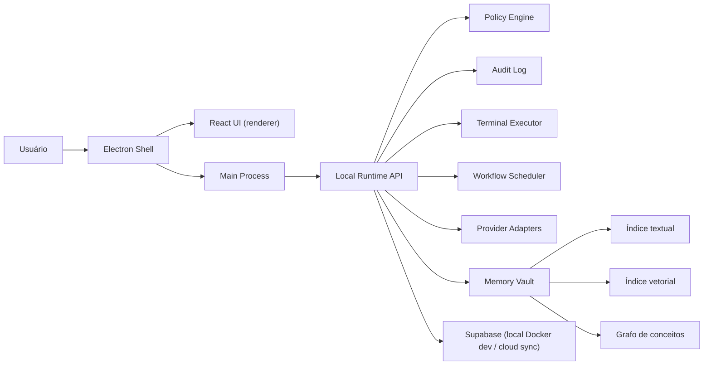

# ARCHITECTURE.md — rrb-jarvisOS

Fonte de decisão: `docs/DECISIONS.md`. Requisitos completos: `docs/iniciais/requisitos-agent-os.md`. Plano técnico detalhado por fases: `docs/iniciais/plano-implementacao-agent-os.md`. Este arquivo é o resumo operacional — se conflitar com um ADR, o ADR vence.

## Tese

Desktop app **local-first** (ADR-001): execução, memória de trabalho e estado operam no dispositivo e funcionam offline nos fluxos essenciais. Supabase Cloud é espelho de sync, auth e auditoria — reconstruível a partir dele, mas nunca pré-requisito para operar. Agentes rodam enquanto o app está ativo (inclusive em tray); não sobrevivem a logout/reboot.

O erro mais provável do projeto é integrar tudo ao mesmo tempo. A ordem defensável: shell → modelo de dados → permissões/auditoria → execução allowlisted → provedores externos → voz.

## Desenho



## Módulos

| Módulo | Responsabilidade | Regra crítica |
|---|---|---|
| **Electron Shell** | Janela, tray, IPC, ponte segura UI↔runtime | Renderer sem Node; IPC mínimo e tipado via preload |
| **React UI** | Telas dos espaços NOA/JARVIS OS e do Agentic OS | Consome contratos, nunca objetos soltos; módulos plugáveis |
| **Local Runtime API** | Domínio, comandos, auditoria, orçamento, execução | Camada de domínio independente do Electron |
| **Policy Engine** | Classificar risco (baixo/médio/alto/bloqueado), orçamento, allowlist, aprovação humana | **Fail closed**; toda decisão gera `AuditEvent` |
| **Terminal Executor** | Comandos reais pós-validação | Allowlist, cwd permitido, timeout, sem admin no MVP |
| **Provider Adapters** | OpenAI, Claude (API + Code CLI), Gemini, Google Workspace, ElevenLabs, Ollama | BudgetPolicy **antes** da chamada; custo/latência medidos |
| **Memory & Knowledge** | Ingestão, índices textual/vetorial/grafo, RAG rastreável | RLS herdada da fonte em todo índice; `inferred` ≠ `confirmed`; exclusão remove de todos os índices |
| **Voice Layer** | STT/TTS online no MVP; offline como evolução | Entra depois do Command Center textual; mesma política de aprovação |
| **Supabase** | Dev: metadados/RLS/migrações. Prod: espelho sync/auth/auditoria | Local é fonte de verdade operacional |

## Dados

- Espaços: `noa` (pessoal) e `jarvis` (profissional). **`Desenvolvimento` é plataforma, não workspace. `Agentic OS` é área interna do JARVIS OS, nunca um quarto workspace** — usa o `workspace_id` do JARVIS OS.
- Toda entidade persistida carrega os campos de escopo do `docs/CONVENTION.md` (`user_id`, `workspace_id`, e quando aplicável `organization_id`, `visibility`, `sensitivity`).
- Isolamento: NOA privado por padrão; JARVIS OS nunca acessa `personal`/`financial`/`health` sem aprovação explícita; compartilhamento NOA↔JARVIS bloqueado no MVP.
- Entidades da fundação: `UserProfile`, `Workspace`, `Session`, `AuditEvent`. Modelo completo (Agent, Squad, Skill, Workflow, Memory*, etc.) em `docs/iniciais/requisitos-agent-os.md` § Modelo de Informação.
- `AuditEvent` é imutável e append-only desde a primeira fatia.

## Fronteiras de segurança

1. Renderer nunca executa comando, nunca lê segredo, nunca acessa Node.
2. Main process não decide política sozinho — chama o Policy Engine.
3. Runtime registra auditoria antes e depois de ação sensível.
4. Toda integração externa passa por adapter; credencial vive em vault/env, nunca em UI ou log.
5. Segredos ausentes aparecem como `missing`, sem revelar valor.
6. **O executor autônomo roda no container, nunca no host** (decisão do PI, 2026-08-29; implementada na M9-F03). A allowlist de comandos do MVP-004 governa o terminal **do usuário**; o agente que constrói software precisa rodar comando arbitrário, e a fronteira que reconcilia os dois é o Docker. Docker ausente é `BLOCKED_EXTERNAL` — **não existe fallback para o host**, e é essa ausência que fecha o buraco. O container recebe o worktree e a URL do proxy; **nenhum segredo**: token, chave e a sessão `~/.claude` ficam no main, e o proxy do host injeta a credencial e registra uso no ponto único (`AiCallService`).

## Resiliência

- **Offline**: fluxos essenciais operam sem internet; sessão auth cacheada localmente (duração: questão aberta do ADR-001, proposta em SPEC-Fundacao-03).
- **Fail closed**: ação não reconhecida pela política é bloqueada, não permitida.
- **Orçamento**: BudgetPolicy (padrão USD 1/dia e USD 1/mês) verificada antes de qualquer chamada paga; com BYOK é estimativa + alerta, não bloqueio garantido (custo aceito no ADR-001).
- **Serviços internos**: healthcheck por serviço; serviço crítico offline bloqueia automações dependentes e gera notificação + `AuditEvent`.
- **Execução**: timeout obrigatório, kill process, retry state em falha de workflow.
- **Sync**: estratégia de conflito multi-dispositivo ainda aberta (ADR-001, questão 3) — não implementar sync bidirecional antes de decidir.

## Providers

Todo provider entra por adapter isolado, atrás do ponto único de chamada (`AiCallService`). Os dois de assinatura são **subprocessos app-managed**: binário pinado, `shell: false`, args montados pelo app, prompt por stdin, `env` em lista de permissão, timeout com `SIGKILL`.

### Isolamento do CLI por fase (emenda E1 da SPEC-Fases-03, 2026-09-05)

Nas fases **Planejamento** e **Especificação** o CLI é um gerador de documento: sem persona de agente, sem ferramentas, sem settings do ambiente. Na **Construção** o agente é legítimo e essas restrições não se aplicam — aplicá-las ali quebraria o run.

**cwd neutro, nos dois adapters.** Um diretório vazio por geração sob `app.getPath('userData')/cli-runs/<uuid>`, removido em todos os desfechos (conclusão, falha, cancelamento, timeout). Nunca `process.cwd()`: em desenvolvimento esse diretório é o repositório do próprio app, e o CLI carregava `CLAUDE.md`, `.claude/`, regras, hooks, skills e MCPs deste projeto para gerar o documento de outro.

**Versões mínimas suportadas** — as instaladas no PC do PI em 2026-09-05, com cada flag confirmada em `--help`:

| CLI | versão mínima | flags de isolamento |
|---|---|---|
| `claude` | **2.1.258** | `--system-prompt`, `--tools ""`, `--setting-sources ""`, `--strict-mcp-config`, `--no-session-persistence`, `--json-schema` |
| `codex` | **0.149.0** | `--sandbox read-only`, `--skip-git-repo-check` |

Flag que a versão instalada não reconhece = `AdapterError` que a nomeia, nunca fallback silencioso para a invocação sem isolamento.

**A saída estruturada vem por ferramenta, não por texto.** Com `--json-schema`, o `claude` não pede JSON em prosa: ele injeta a ferramenta `StructuredOutput` e o modelo responde chamando-a, com o documento no `input`. Por isso `--tools ""` e `--json-schema` **convivem**: o `system/init` reporta `"tools":["StructuredOutput"]`, e mais nada. **O modelo às vezes escreve o JSON em texto antes** (o system pede "responda somente com JSON", e ele obedece); o CLI não aceita texto como saída estruturada, injeta `[structured-output-enforce]` e o modelo repete o documento pela ferramenta. Numa geração com schema, **texto do modelo não é documento**: o documento é o `input` da **última** chamada de `StructuredOutput` (decisão do PI, 2026-09-05), retido no parser e entregue no `close`; o texto só vira documento se nenhuma chamada chegar (#304).

**O Codex tem duas fontes de contexto.** O cwd é uma; a outra é o `CODEX_HOME`, que carrega plugins e hooks de `~/.codex/` independentemente do diretório. O `--sandbox read-only` não os desliga — quem fecha essa porta é o `CODEX_HOME` da pipeline (M10-F02). O isolamento do Codex é a soma dos dois.

**Texto de mensagem `user` nunca é documento.** O CLI usa mensagens `user` para injetar o corpo de uma skill, um `system-reminder` ou o resultado de uma ferramenta. Isso é evidência de console, truncada em 2 KB, e não conteúdo gerado.

**Idioma declarado.** Todo system de geração carrega `IDIOMA_DA_SAIDA`: pt-BR para o conteúdo, inglês para identificadores de código. Sem a linha, a saída em português era imitação do prompt, não contrato.

## Dependências críticas (ordem que não pode inverter)

1. Policy Engine antes de terminal real.
2. `AuditEvent` antes de providers reais.
3. BudgetPolicy antes de qualquer chamada paga.
4. Modelo multiusuário antes de Supabase persistente.
5. Command Center textual antes de voz.
6. Execução manual antes de cron/autonomia.
7. RLS das fontes antes de índices de memória; proveniência antes de RAG para agentes.

## Stack

Electron · React · TypeScript · Vite · Vitest · Playwright · Tailwind (+ Radix ad-hoc) · Supabase (dev na nuvem para OAuth — ADR-002; Docker local na fase de persistência) · SQLite local (proposta SPEC-Fundacao-04).

Estrutura de diretórios: `src/main/` (electron, ipc, runtime) · `src/renderer/` (app, components, modules, styles) · `src/shared/` (domain, contracts, policies) · `supabase/` (migrations, seed) · `tests/` · `e2e/`.

## Pipeline de desenvolvimento governado (desenho aprovado; não implementado)

A capacidade de desenvolvimento autônomo foi separada em três MVPs executáveis e um MVP de memória não bloqueante:

`MVP-006 Conectores Essenciais → MVP-008 Planejamento Governado → MVP-009 Entrega Autônoma`; o `MVP-007 Memória Contextual/RAG` entrou em detalhamento com direção aprovada em 2026-08-30 e não bloqueia a sequência.

- **MVP-006:** runtime comum de conectores, GitHub App por Device Flow e ResearchAdapter Tavily Search+Extract.
- **MVP-008:** projeto/SQLite/Git local, ContextPack, wizard, PRD/Landscape/Convention, anexos do PI, arquitetura, roadmap e aprovações por hash.
- **MVP-009:** publicação GitHub, DAG/fila WIP=1, reconciliação, worktree, Claude Code, revisão, CI, squash merge e evidência.

### MVP-007 — Memória compartilhada (F01–F06 aprovadas)

JarvisOS e AgentsOS compartilham um núcleo de conhecimento, inclusive sobre o desenvolvimento dos próprios produtos. Histórico mantém os módulos de origem como donos dos fatos; o conhecimento usa relações derivadas/reconstruíveis, com Graphify opcional e substituível; aprendizado exige evidência, com validação operacional da pipeline mantida no MVP-016.

Agent Memory, Notebook, centros de comando e demais superfícies previstas consultam esse núcleo; não criam memórias independentes. Visão global conserva identidade de produto/projeto/agente e não aplica regras entre projetos automaticamente. A M16-F05 mantém seu recorte e contrato reutilizável, sem depender da entrega do MVP-007. O catálogo aprovado captura eventos de projetos, agentes, operações e conhecimento explícito; atualização incremental/assíncrona usa o orçamento existente, mantendo originais nos donos e lacunas de cobertura visíveis. Contratos técnicos ainda serão especificados; não há implementação autorizada.

Identidade estável vem da origem, não do nome/caminho. Reentrega do mesmo evento não duplica ocorrência; fontes distintas mantêm proveniência e correções criam revisões. Contradição sem prova de substituição permanece explícita, e remoção/desatualização da fonte invalida conhecimento dependente como atual. Núcleo v1 aprovado em `docs/spec/spec-memoria-01-nucleo-identidade-persistencia.md`, revisão `83e952f`: SQLite existente, identidade composta, revisões/eventos separados e confirmação atômica. AgentsOS é origem no workspace Jarvis, não um novo workspace. Ingestão aprovada em `docs/spec/spec-memoria-02-fontes-ingestao-retomada.md`, revisão `e4a521c`: Git selecionado/commitado desde a inscrição, reconciliação de decisões existentes, dono canônico interno de notas sem UI, cobertura explícita e confirmação por prefixo junto ao checkpoint. Recuperação aprovada em `docs/spec/spec-memoria-03-recuperacao-contextual-orcamento.md`, revisão `c3b546a`: busca lexical local e relações opcionais, validade/cobertura explícitas, expansão limitada à parcela de orçamento e ponte opcional com ContextPack, preservando o bloco exato enviado. Manutenção aprovada em `docs/spec/spec-memoria-04-retencao-reconstrucao.md`, revisão `027f827`: compactação reversível após 30 dias, reconstrução por partição/geração com journal e publicação atômica, exclusão escopada com barreira durável contra reingestão e limites de capacidade/agenda. Preserva originais, auditoria e ContextPacks congelados; não executa VACUUM automático. Depende somente de F02, com manutenção de FTS/Graphify opcional. A F05 está aprovada pela revisão `6f8c7f6` e a F06 pela revisão `4f47c12`; F07–F08 ainda serão especificadas. Não há implementação autorizada.

Persistência usa o armazenamento local existente. Memória durável permanece durante a vida do projeto, salvo exclusão explícita; detalhes repetitivos das projeções compactam após 30 dias com preservação de marcos e evidências necessárias, sem alterar retenção dos donos. Grafo/cache são reconstruíveis somente com fontes disponíveis, preservando invalidações; reconstrução não é backup. Falha do grafo usa mecanismos básicos/fontes sem bloquear a pipeline. Sincronização fica para recorte próprio.

Recuperação começa por tarefa/projeto, com busca textual e relações do grafo, sem embeddings obrigatórios. Ampliação justificada respeita permissões e limites do solicitante; respostas trazem trechos, fonte/revisão, validade, contradições e lacunas. Na pipeline, a memória fornece candidatos e o `ContextPack` mantém a composição final e seu orçamento. Nenhuma consulta amplia autoridade de execução.

Fontes entram por adaptadores de leitura: projetos registrados, registros dos módulos disponíveis e conhecimento explícito. Adaptador identifica registros/revisões, entrega alterações e informa cobertura; a memória mantém seu progresso sem modificar originais. O núcleo opera primeiro com projetos/documentos e conhecimento explícito, sem depender de todos os menus futuros. Fontes externas precisam de integração própria; Graphify não escolhe acessos nem dispara varredura universal.

Ingestão usa referência de corte na carga inicial e progresso próprio por fonte, persistido consistentemente com os resultados. Retomada parte do último ponto confirmado; reentregas são deduplicadas e divergência na mesma identidade/revisão é conflito. Evento problemático vira pendência durável antes de continuar, sem ser marcado como aplicado. Fontes falham independentemente, com retentativas progressivas e consumo limitado. Cobertura distingue carga, atualização, atraso, pendência e indisponibilidade; histórico expirado exige reconciliação do disponível e lacuna explícita, sem promessa de recuperação completa.

Graphify entra por adapter substituível com contrato próprio. A M7-F05 aprovada fixa `graphifyy==0.9.53` como baseline de compatibilidade, runtime isolado instalado somente por ação explícita e projeção `graphify-out/` local/ignorada por projeto-alvo. A pipeline cria depois da fatia marcada como fundação e atualiza incrementalmente a cada quatro PRs incorporados à principal; entre checkpoints combina grafo com delta do Git. Consulta limitada devolve candidatos com fonte/revisão e extração/inferência; o código atual comprova fatos. Perguntas finais são ignoradas sem gate, e `save-result`/`reflect` não são usados. Ausência, incompatibilidade, expurgo não comprovado ou falha mantêm busca básica, sem rebuild, API paga ou instalação global automática.

A M7-F06 aprovada, revisão `4f47c12`, define ledger imutável de evidências/avaliações e estado atual derivado. O módulo de origem define critérios/dimensões versionados; a memória coordena sem interpretar sucesso. A V1 avalia expectativa de execução e gate de entrega, limita validação ao projeto de origem e publica cobertura `available | unavailable | unsupported | stale`. Contradição, mudança material, incompatibilidade ou perda de prova retira a condição validada sem bloquear desenvolvimento. F03 serve normalmente apenas lições validadas e aplicáveis; F04 rege exclusão; MVP-016 continua dono do aprendizado da pipeline.

Fora da pipeline, o módulo responsável valida lições por critérios verificáveis de sua especificação; a memória registra afirmação, contexto, fontes, resultados e avaliação. Critérios objetivos permitem automação sem aceite duplicado; ausência de critério/evidência mantém a candidata sem bloquear desenvolvimento. Validade limita-se às condições/versões comprovadas, com falhas e contrapontos; mudanças relevantes ou contradições retiram a validade vigente até reavaliação, preservando histórico. Decisões do PI não são comprovação empírica e lições não ampliam permissões. A pipeline mantém avaliação/promoção no MVP-016.

O contrato comum dos registros/eventos possui envelope versionado por tipo, origem e escopo, convertido pelos adaptadores sem mudar os produtores. `recordId`, `sourceRevision` e `eventId` separam registro, revisão e evento, vinculados ao produto/escopo/fonte; conhecimento do produto não precisa de projeto fictício. Tempos do acontecimento e da recepção não determinam substituição. Conteúdo tipado referencia fontes; invalidação por remoção/desatualização não se confunde com indisponibilidade temporária. Incompatibilidade vira pendência rastreável; progresso de ingestão fica separado da identidade.

Fonte: `docs/superpowers/specs/2026-08-30-mvp-007-memoria-compartilhada-design.md`.

### Pipeline V2 aprovada (não implementada)

`MVP-010 Multi-executor → MVP-011 Squads limitados → MVP-012 Scheduler concorrente → MVP-013 Execução contínua`.

- `CodingExecutorRuntime` é irmão de `AIProviderRuntime` e `ConnectorRuntime`; Claude Code e Codex implementam adapters próprios.
- V1 mantém um slot global; V2 permite dois executores globais e até duas fatias independentes por projeto.
- O núcleo determinístico continua dono de gates, fila, efeitos externos, Git e merge; Squads não ampliam a SPEC.
- A V2 termina no merge do DAG aprovado. Deploy e produção permanecem fora.
- Fonte completa: `docs/superpowers/specs/2026-08-29-pipeline-desenvolvimento-ia-v2-design.md`.

### Pipeline V3 — Release, operação e aprendizado (MVP-014–016 detalhados; não implementados)

`MVP-014 Release → MVP-015 Observabilidade → MVP-016 Aprendizado operacional → MVP-023 Blueprints → MVP-024 Portfólio`.

O MVP-014 separa dois fluxos: `PreviewRun` por PR/fatia e `ReleaseRun` após merge. O núcleo determinístico mantém fila, estados, gates, idempotência, leases e compensações; adapters híbridos e CLI-first integram Docker Compose, GHCR, Vercel e Railway.

```text
PR/SPEC ── PreviewCoordinator ── Vercel Preview + Railway backend/Postgres temporários

Merge ── ReleaseQueue ── ReleaseOrchestrator
                         ├── GHCR: imagem OCI por digest
                         ├── Staging: Railway + Vercel + Postgres separados
                         ├── Produção: mesmos artefatos, migration e estabilização
                         └── Falha de código: correção pela Pipeline V2
```

Local, cada Preview, Staging e Produção possuem configurações e bancos separados. Migration é forward-only; compensação automática alcança aplicações, não restaura banco. Produção é automática depois dos gates e não espera fechamento administrativo da issue.

Fonte completa: `docs/superpowers/specs/2026-08-29-pipeline-desenvolvimento-ia-v3-design.md` e `docs/mvp/mvp-014-release-deploy-governado.md`.

O MVP-015 adiciona uma camada local-first de leitura, sem assumir autoridade do orquestrador:

```text
Domínios ── estado + outbox SQLite ── projetores ── eventos/métricas/alertas
                                                     ▲
Provedores ── reconciliadores tipados ────────────────┘
                                                     │
                                      ObservabilityQueryService
                                           ├── IPC → Console React
                                           └── CLI read-only
```

O main process é o único dono do SQLite. UI e CLI compartilham contratos de consulta; o renderer recebe snapshot e deltas versionados. Logs brutos não são copiados. O observador persiste fatos permitidos por schema, reconcilia GitHub/GHCR/Vercel/Railway/executores, mantém rollups e emite alertas determinísticos. Falha do observador degrada o painel, nunca reverte ou bloqueia a operação canônica.

Fonte completa: `docs/superpowers/specs/2026-08-29-mvp-015-observabilidade-operacional-design.md` e `docs/mvp/mvp-015-observabilidade-operacional.md`.

O MVP-016 consome evidências dos runs de forma assíncrona e entrega políticas versionadas aos mecanismos existentes:

```text
Evidências ── ingestão/atributos ── memória de falhas ── candidatas
                                                         │
                                   replay → shadow → canário
                                                         │
                                      PolicyRegistry/Resolver
                                                         │
                                        PolicySnapshot por run
                                                         │
                               ContextSelector/RecoveryController existentes
```

Política por projeto vence padrão global local. Cada run congela seu snapshot; promoção nunca altera execução em andamento. Claude/Codex podem propor hipóteses, mas guardrails e promoção são determinísticos. Falha do aprendizado mantém a última política estável ou a base e nunca bloqueia construção, merge ou release. O MVP-016 não substitui a memória/RAG do MVP-007 nem duplica os atuadores dos MVPs 008/009.

A M16-F03 detalha pacotes completos por mecanismo, validação da composição e fallback conjunto do grupo afetado. O registro recebe decisões com prova da F04, não promove por simples cadastro. O snapshot autossuficiente é gravado pelo dono do run na transação de criação; índices do aprendizado são derivados. Retomada do mesmo run lê essa cópia, enquanto pausa, quotas e demais controles operacionais seguem vigentes. SPEC aprovada pelo PI: `docs/spec/spec-aprendizado-03-registro-resolucao-politicas.md`.

A M16-F04 coordena contratos imutáveis, replay/shadow sem efeitos externos, alocação de canário com controle contemporâneo e avaliador determinístico. Produz as decisões condicionais para o registro F03 e acompanha estabilização/rollback; não cria outro executor ou dono dos efeitos. Ativa e estável são distintas, com amostra/tempo explícitos e fallback não bloqueante. SPEC aprovada pelo PI: `docs/spec/spec-aprendizado-04-experimentos-promocao.md`, revisão `1cefc2c`.

Fonte completa: `docs/superpowers/specs/2026-08-29-mvp-016-aprendizado-operacional-design.md` e `docs/mvp/mvp-016-aprendizado-operacional.md`.

### Fontes de verdade

- arquivos versionados: conteúdo aprovado;
- Git: revisões e hashes;
- SQLite: sessão, fila, runs, tentativas, leases e projeções;
- Vault: material secreto;
- GitHub: issue, PR, checks e merge;
- `STATUS.md`: índice Fatia ↔ SPEC;
- ledger: custo, eventos e evidências.

O reconciliador consulta as fontes reais antes de repetir efeitos. Uma saída de processo não substitui confirmação no GitHub/filesystem.

### Fronteiras específicas

- O PI anexa `DESIGN-SYSTEM.md`, HTML e assets depois do PRD; arquitetura aguarda esses anexos.
- Context7 atende documentação técnica atual; Tavily atende mercado e web geral.
- Conteúdo externo é dado não confiável.
- O checkout ativo nunca é cwd do executor; cada fatia usa worktree e base SHA registrados. O cwd do executor é sempre um caminho **de dentro do container** — `SandboxPreparado` não tem campo para o par no host, de propósito.
- **O `.git` principal é montado somente-leitura no container, e o metadado do worktree vai copiado.** Não é preferência: o `commondir` de um worktree é relativo e resolve para `/` dentro do container (`fatal: not a git repository`), e objects e refs vivem no `.git` principal. Reescrever o `commondir` original **derruba o Git do host** — os dois lados precisam de caminhos diferentes no mesmo arquivo. Ambos medidos com Docker real na M9-F03.
- **O worktree nasce com `core.autocrlf=false`.** No Windows o checkout padrão grava CRLF e o Git do container (Linux) lê toda a árvore como modificada — o gate de escopo acusaria fuga em todo arquivo do projeto.
- **O escopo de arquivos de um run é registrado antes da execução**, no `ContextPack`, com a origem (`spec` ou `derivada`). É a lista registrada que vale no gate de diff — nunca uma inferência no instante do commit.
- Git após aprovação é automático; merge não cria aceite adicional.
- Documento/ADR auxiliar não bloqueia código depois da SPEC aprovada.
- A pipeline não herda nem inventa classificação de saúde, finanças, documentos, LGPD ou consentimento.

Documentos canônicos: `docs/mvp/mvp-006-conectores-essenciais.md`, `mvp-008-planejamento-governado.md`, `mvp-009-entrega-autonoma.md` e suas SPECs.


### Fechamento documental da V3 (2026-08-31)

V3 possui 25 SPECs: quinze previamente aprovadas (MVP-014/015 e M16-F01–F04), duas novas de aprendizado e oito novas de Blueprints/Portfólio. As dez novas são rascunho-completo. Blueprints tem catálogo/revisões, instanciação, anexos/evolução e UI; Portfólio tem consultas, controles pelos donos, custos/quotas e UI. São módulos planejados, não serviços já implementados. Designs e vínculos estão no índice canônico STATUS.

MVP-005 entregue conserva seu contrato original de providers; separação de runtimes é evolução da M10-F01, não garantia retroativa. A noção de quota da assinatura é pré-requisito explícito da M9-F04 (PR #207), não entrega presumida da M5-F04. O diário de efeitos pertence à M9-F02 e sua falha real está na #209, não nas SPECs finalizadas M6-F01/F02.
