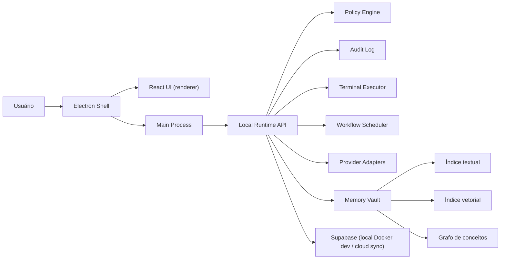

# ARCHITECTURE.md — rrb-jarvisOS

Fonte de decisão: `docs/DECISIONS.md`. Requisitos completos: `docs/iniciais/requisitos-agent-os.md`. Plano técnico detalhado por fases: `docs/iniciais/plano-implementacao-agent-os.md`. Este arquivo é o resumo operacional — se conflitar com um ADR, o ADR vence.

## Tese

Desktop app **local-first** (ADR-001): execução, memória de trabalho e estado operam no dispositivo e funcionam offline nos fluxos essenciais. Supabase Cloud é espelho de sync, auth e auditoria — reconstruível a partir dele, mas nunca pré-requisito para operar. Agentes rodam enquanto o app está ativo (inclusive em tray); não sobrevivem a logout/reboot.

O erro mais provável do projeto é integrar tudo ao mesmo tempo. A ordem defensável: shell → modelo de dados → permissões/auditoria → execução allowlisted → provedores externos → voz.

## Desenho

## Módulos

| Módulo | Responsabilidade | Regra crítica |
|---|---|---|
| **Electron Shell** | Janela, tray, IPC, ponte segura UI↔runtime | Renderer sem Node; IPC mínimo e tipado via preload |
| **React UI** | Telas dos espaços NOA/JARVIS OS e do Agentic OS | Consome contratos, nunca objetos soltos; módulos plugáveis |
| **Local Runtime API** | Domínio, comandos, auditoria, orçamento, execução | Camada de domínio independente do Electron |
| **Policy Engine** | Classificar risco (baixo/médio/alto/bloqueado), orçamento, allowlist, aprovação humana | **Fail closed**; toda decisão gera `AuditEvent` |
| **Terminal Executor** | Comandos reais pós-validação | Allowlist, cwd permitido, timeout, sem admin no MVP |
| **Provider Adapters** | OpenAI, Claude (API + Code CLI), Gemini, Google Workspace, ElevenLabs, Ollama | BudgetPolicy **antes** da chamada; custo/latência medidos |
| **Memory & Knowledge** | Ingestão, índices textual/vetorial/grafo, RAG rastreável | RLS herdada da fonte em todo índice; `inferred` ≠ `confirmed`; exclusão remove de todos os índices |
| **Voice Layer** | STT/TTS online no MVP; offline como evolução | Entra depois do Command Center textual; mesma política de aprovação |
| **Supabase** | Dev: metadados/RLS/migrações. Prod: espelho sync/auth/auditoria | Local é fonte de verdade operacional |

## Dados

- Espaços: `noa` (pessoal) e `jarvis` (profissional). **`Desenvolvimento` é plataforma, não workspace. `Agentic OS` é área interna do JARVIS OS, nunca um quarto workspace** — usa o `workspace_id` do JARVIS OS.
- Toda entidade persistida carrega os campos de escopo do `docs/CONVENTION.md` (`user_id`, `workspace_id`, e quando aplicável `organization_id`, `visibility`, `sensitivity`).
- Isolamento: NOA privado por padrão; JARVIS OS nunca acessa `personal`/`financial`/`health` sem aprovação explícita; compartilhamento NOA↔JARVIS bloqueado no MVP.
- Entidades da fundação: `UserProfile`, `Workspace`, `Session`, `AuditEvent`. Modelo completo (Agent, Squad, Skill, Workflow, Memory*, etc.) em `docs/iniciais/requisitos-agent-os.md` § Modelo de Informação.
- `AuditEvent` é imutável e append-only desde a primeira fatia.

## Fronteiras de segurança

1. Renderer nunca executa comando, nunca lê segredo, nunca acessa Node.
2. Main process não decide política sozinho — chama o Policy Engine.
3. Runtime registra auditoria antes e depois de ação sensível.
4. Toda integração externa passa por adapter; credencial vive em vault/env, nunca em UI ou log.
5. Segredos ausentes aparecem como `missing`, sem revelar valor.

## Resiliência

- **Offline**: fluxos essenciais operam sem internet; sessão auth cacheada localmente (duração: questão aberta do ADR-001, proposta em SPEC-Fundacao-03).
- **Fail closed**: ação não reconhecida pela política é bloqueada, não permitida.
- **Orçamento**: BudgetPolicy (padrão USD 1/dia e USD 1/mês) verificada antes de qualquer chamada paga; com BYOK é estimativa + alerta, não bloqueio garantido (custo aceito no ADR-001).
- **Serviços internos**: healthcheck por serviço; serviço crítico offline bloqueia automações dependentes e gera notificação + `AuditEvent`.
- **Execução**: timeout obrigatório, kill process, retry state em falha de workflow.
- **Sync**: estratégia de conflito multi-dispositivo ainda aberta (ADR-001, questão 3) — não implementar sync bidirecional antes de decidir.

## Dependências críticas (ordem que não pode inverter)

1. Policy Engine antes de terminal real.
2. `AuditEvent` antes de providers reais.
3. BudgetPolicy antes de qualquer chamada paga.
4. Modelo multiusuário antes de Supabase persistente.
5. Command Center textual antes de voz.
6. Execução manual antes de cron/autonomia.
7. RLS das fontes antes de índices de memória; proveniência antes de RAG para agentes.

## Stack

Electron · React · TypeScript · Vite · Vitest · Playwright · Tailwind (+ Radix ad-hoc) · Supabase (dev na nuvem para OAuth — ADR-002; Docker local na fase de persistência) · SQLite local (proposta SPEC-Fundacao-04).

Estrutura de diretórios: `src/main/` (electron, ipc, runtime) · `src/renderer/` (app, components, modules, styles) · `src/shared/` (domain, contracts, policies) · `supabase/` (migrations, seed) · `tests/` · `e2e/`.
