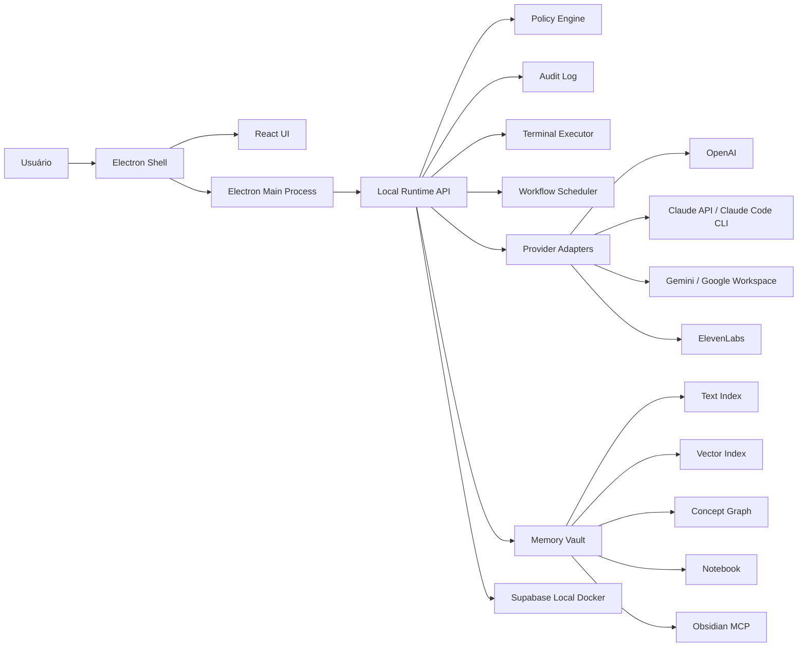

# Plano de Implementação: Agent OS JARVIS OS / NOA

## Fonte de Verdade

- Requisitos: `docs/requisitos-agent-os.md`.
- Fronteiras de domínio: `docs/fronteiras-desenvolvimento-noa-jarvisos.md`.
- Este plano não substitui a spec; ele define ordem técnica, dependências e checkpoints.

## Tese Técnica

O produto deve começar como um desktop app Electron com runtime local controlado, UI rica e backend modular. O erro mais provável seria tentar integrar voz, agentes reais, OAuth, Supabase, terminal e automações ao mesmo tempo. O caminho defensável é construir primeiro o shell, o modelo de dados, o sistema de permissões e a auditoria; depois ligar execução real por allowlist; só então conectar provedores externos.

Outra separação necessária: `Desenvolvimento` não é feature do NOA nem do JARVIS OS. Desenvolvimento constrói a plataforma compartilhada; NOA e JARVIS OS consomem essa plataforma com dados, políticas e navegação separados.

`Agentic OS` é uma área interna do JARVIS OS. Ela organiza Mission Control, Specialties, Skills Catalog, Harnesses, Specialist Teams, Operator Central, Agent Memory e Notebook sem criar outro workspace ou duplicar capacidades do runtime.

## Arquitetura Alvo



## Componentes Principais

### 1. Electron Shell

Responsável por janela desktop, menu, tray, IPC, permissões locais e ponte segura entre UI e runtime.

Dependências:

- Runtime local.
- Policy Engine.
- Configuração do usuário/admin.

Riscos:

- Expor APIs perigosas no renderer.
- Virar apenas uma página web empacotada, sem controle real do ambiente local.

Mitigação:

- IPC mínimo e tipado.
- Renderer sem acesso direto a Node.
- Todas as operações sensíveis passam pelo Policy Engine.

### 2. React UI

Responsável pela experiência visual: Command Center, Agentic OS, Mission Control, Specialties, Skills Catalog, Harnesses, Specialist Teams, Operator Central, Agent Memory, Notebook, Kanban, Workflows, Automations, OS Desktop, Connectors, Providers e Settings.

Dependências:

- Design tokens.
- Store de estado local.
- Contratos de API do runtime.

Riscos:

- UI bonita, mas sem ergonomia operacional.
- Telas demais antes de haver fluxo real.

Mitigação:

- Implementar telas como módulos plugáveis.
- Começar com dados mockados estruturados no mesmo formato dos contratos reais.

### 3. Runtime Local API

Serviço local chamado pelo Electron Main para centralizar domínio, comandos, auditoria, orçamento e execução.

Responsabilidades:

- Workspaces NOA/JARVIS OS.
- Usuários e papéis.
- Agents, squads, skills, workflows e automações.
- Specialties, fontes de memória, notas, conceitos, relações e recuperações RAG.
- Terminal allowlisted.
- Registro de eventos.
- Integração com Supabase local.

Riscos:

- Misturar lógica no renderer.
- Acoplar runtime à primeira UI.

Mitigação:

- Contratos explícitos por módulo.
- Camada de domínio independente do Electron.

### 4. Supabase Local Docker

Banco local de desenvolvimento para metadados, auditoria, autenticação e sincronização futura.

Responsabilidades:

- Tabelas do domínio.
- RLS desde cedo.
- Migrações versionadas.
- Seeds de desenvolvimento.

Riscos:

- Multiusuário sem isolamento real.
- Deixar RLS para depois.

Mitigação:

- Modelar `user_id`, `workspace_id` e `organization_id` desde a primeira migração.
- Testar permissões com fixtures de usuários diferentes.

### 5. Policy Engine

Camada obrigatória antes de qualquer ação sensível.

Responsabilidades:

- Classificar risco: baixo, médio, alto, bloqueado.
- Aplicar orçamento diário/mensal.
- Validar allowlist de diretórios.
- Exigir aprovação humana.
- Bloquear comandos perigosos.

Riscos:

- Terminal real causar dano local.
- Conectores externos executarem ações sem revisão.

Mitigação:

- Fail closed: se a política não reconhecer uma ação, bloqueia.
- Logs de decisão de política sempre geram `AuditEvent`.

### 6. Terminal Executor

Executa comandos reais somente após validação.

Responsabilidades:

- Working directory permitido.
- Comandos allowlisted.
- Captura de stdout/stderr.
- Timeout.
- Kill process.
- Auditoria.

Riscos:

- Shell injection.
- Comandos destrutivos.
- Travamento de processo.

Mitigação:

- Executar comando por argumentos estruturados quando possível.
- Bloquear padrões perigosos.
- Timeout obrigatório.
- Sem execução administrativa no MVP.

### 7. Provider Adapters

Abstraem OpenAI, Claude, Gemini, Google Workspace, ElevenLabs, Ollama e futuros provedores.

Responsabilidades:

- Configuração segura.
- Healthcheck.
- Custos.
- Latência.
- Fallback.

Riscos:

- SDKs e APIs mudarem.
- Custos sem controle.

Mitigação:

- Adapter por provedor.
- Medição de custo por chamada.
- BudgetPolicy antes da chamada.

### 8. Memory and Knowledge Layer

Capacidade compartilhada de armazenamento e recuperação de contexto, exposta no JARVIS OS pela área Agentic OS e no NOA por módulos pessoais separados.

Responsabilidades:

- Ingerir notas, artefatos, arquivos permitidos e páginas do Obsidian MCP.
- Preservar fonte, versão, autoria, sensibilidade e escopo de workspace.
- Manter índices textual, vetorial e de grafo.
- Recuperar contexto por RAG e registrar fontes e trechos usados.
- Remover conteúdo de todos os índices quando a fonte expirar, for excluída ou perder autorização.

Riscos:

- Vazamento entre NOA, JARVIS OS, usuários ou organizações.
- Relações inferidas serem apresentadas como fatos confirmados.
- Conteúdo revogado continuar recuperável em índice derivado.

Mitigação:

- Autorização e RLS herdadas da fonte em todos os índices.
- Proveniência obrigatória em conceitos, relações e recuperações.
- Diferenciar relações `inferred` e `confirmed`.

### 9. Voice Layer

No MVP, voz online. Offline fica preparada como extensão.

Responsabilidades:

- Captura de áudio.
- STT online.
- Roteamento para Command Center.
- TTS online.
- Fallback textual.

Riscos:

- Voz bloquear o núcleo do sistema.
- Comando de voz executar ação sensível sem confirmação.

Mitigação:

- Voz entra após Command Center textual.
- Toda intenção vira ação auditável e passa pela mesma política.

## Ordem de Implementação

Cada fase deve ser classificada como:

- `Plataforma`: desenvolvimento técnico compartilhado.
- `NOA`: domínio pessoal.
- `JARVIS OS`: domínio profissional/operacional.
- `Compartilhado`: capacidade de plataforma exposta aos dois espaços.

### Fase 0: Bootstrap Técnico

Classificação: `Plataforma`.

Objetivo:

- Criar base Electron + React + TypeScript.
- Definir comandos de desenvolvimento, build, lint e teste.
- Configurar estrutura de diretórios.

Saída esperada:

- App abre uma janela desktop em Windows.
- Tela inicial renderiza sem backend real.
- Teste mínimo roda no CI/local.

Checkpoint:

- `npm run dev` abre o app.
- `npm run test` passa.
- `npm run lint` passa.

### Fase 1: Shell Visual e Dados Mockados

Classificação: `Compartilhado`, com primeira validação visual em `JARVIS OS`.

Objetivo:

- Implementar shell JARVIS OS/NOA com navegação lateral.
- Criar telas estáticas com dados mockados estruturados.

Módulos:

- Command Center.
- Agentic OS com navegação interna de Core, Harnesses, Teams, Governance e Knowledge.
- Mission Control.
- Specialties.
- Skills Catalog.
- Harnesses.
- Specialist Teams.
- Operator Central.
- Agent Memory com Rede, Recentes, Notas e Busca.
- Notebook.
- Kanban.
- Workflows.
- Automations.
- OS Desktop.
- Connectors.
- Providers.
- Settings.

Checkpoint:

- Usuário alterna NOA/JARVIS OS.
- Item ativo da navegação funciona.
- Telas principais carregam dados mockados.

### Fase 2: Modelo de Domínio Local

Classificação: `Plataforma`.

Objetivo:

- Criar tipos, contratos e stores para entidades centrais.

Entidades:

- `Workspace`.
- `UserProfile`.
- `Agent`.
- `Squad`.
- `Skill`.
- `Workflow`.
- `Automation`.
- `Connector`.
- `Provider`.
- `Execution`.
- `AuditEvent`.
- `BudgetPolicy`.
- `Specialty`.
- `MemorySource`.
- `MemoryEntry`.
- `MemoryChunk`.
- `MemoryConcept`.
- `MemoryRelation`.
- `MemoryRetrieval`.
- `Notebook`.
- `Note`.

Checkpoint:

- UI consome contratos locais, não objetos soltos.
- Testes cobrem transição de workspace e isolamento básico.

### Fase 3: Supabase Local Docker

Classificação: `Plataforma`.

Objetivo:

- Adicionar Supabase local para desenvolvimento.
- Criar migrações e seeds.

Ordem:

1. Configurar Supabase CLI/Docker.
2. Criar schema base.
3. Criar RLS mínima.
4. Criar seed de usuários, workspaces e dados mockados reais.
5. Conectar runtime local ao Supabase.

Checkpoint:

- Supabase sobe localmente.
- Migrações aplicam do zero.
- Usuário A não acessa dados privados do usuário B.

### Fase 4: Runtime Local e Auditoria

Classificação: `Plataforma`.

Objetivo:

- Criar Runtime API local entre Electron e domínio.
- Registrar eventos auditáveis.

Módulos:

- `AuditService`.
- `PolicyService`.
- `BudgetService`.
- `WorkspaceService`.
- `ExecutionService`.

Checkpoint:

- Todo comando do Command Center gera `AuditEvent`.
- Ações desconhecidas são bloqueadas por padrão.
- BudgetPolicy bloqueia gasto acima do limite configurado.

### Fase 5: Agentic OS e Knowledge Local

Classificação: `JARVIS OS` consumindo capacidades de `Plataforma`.

Objetivo:

- Tornar funcional a área Agentic OS dentro do workspace JARVIS OS.
- Implementar o primeiro ciclo local de memória profissional, Notebook e recuperação rastreável.

Ordem:

1. Fixar o Agentic OS como rota/área interna do JARVIS OS, sem novo workspace.
2. Implementar Specialties, catálogo, registro de harnesses e Specialist Teams sobre contratos locais.
3. Implementar Agent Memory com ingestão manual e de artefatos permitidos.
4. Criar índices textual e de grafo; usar adapter mock/local para busca vetorial até a integração de providers.
5. Implementar as visões Rede, Recentes, Notas e Busca.
6. Implementar Notebook com versionamento e opção de indexação.
7. Registrar proveniência e `MemoryRetrieval` em toda recuperação usada por agente.
8. Integrar aprovações do Operator Central às ações sensíveis da área.

Checkpoint:

- Navegar para Agentic OS mantém o workspace JARVIS OS ativo.
- Nota indexada aparece em busca, recentes e rede quando possuir conceitos relacionados.
- Recuperação informa fontes e trechos utilizados.
- Usuário ou workspace diferente não recupera a memória profissional.
- Relação inferida é distinguível de relação confirmada.

### Fase 6: OS Desktop com Terminal Controlado

Classificação: `JARVIS OS` consumindo capacidades de `Plataforma`.

Objetivo:

- Implementar File Explorer, Terminal e System Monitor.

Ordem:

1. Admin configura diretórios permitidos.
2. File Explorer lista apenas diretórios permitidos.
3. Terminal executa comandos allowlisted.
4. Terminal registra stdout, stderr, exit code e duração.
5. Policy Engine bloqueia comandos fora de escopo.

Checkpoint:

- Comando permitido executa.
- Comando bloqueado não executa e gera auditoria.
- Diretório fora da allowlist não é listado nem usado como cwd.

### Fase 7: Workflows e Automations

Classificação: `JARVIS OS` primeiro; `NOA` depois com automações pessoais limitadas.

Objetivo:

- Registrar workflows, automações manuais e scheduler inicial.

Ordem:

1. Criar workflow manual.
2. Executar workflow simulado.
3. Associar agente/squad/skill.
4. Registrar execução e custo estimado.
5. Adicionar crons depois da execução manual estar estável.

Checkpoint:

- Workflow manual executa ponta a ponta.
- Falha gera retry state e auditoria.
- Automação sensível exige aprovação.

### Fase 8: Connectors e Providers Reais

Classificação: `Compartilhado`, com políticas separadas por workspace.

Objetivo:

- Integrar conectores obrigatórios sem expor segredos.

Ordem recomendada:

1. OpenAI, por ser base para texto/STT se escolhido.
2. Claude API.
3. Claude Code CLI como harness local.
4. Google Gemini.
5. Google Workspace.
6. ElevenLabs.
7. Ollama.
8. Obsidian MCP como fonte opcional do Agent Memory.
9. Supabase remoto/sync futuro.

Checkpoint:

- Cada provider tem healthcheck.
- Chamada real respeita BudgetPolicy.
- Credenciais ausentes aparecem como `missing`, sem revelar segredo.
- Busca vetorial e RAG usam provider configurado sem perder a rastreabilidade das fontes.

### Fase 9: Voz Online

Classificação: `Compartilhado`.

Objetivo:

- Ligar microfone ao Command Center via STT online e resposta via TTS online.

Ordem:

1. Comando textual estável.
2. STT online gera texto.
3. Texto entra no mesmo pipeline do Command Center.
4. TTS fala respostas não sensíveis.
5. Ações sensíveis exigem confirmação visual/textual.

Checkpoint:

- Comando de voz simples gera tarefa no Kanban.
- Comando sensível por voz abre aprovação, não executa direto.
- Falha de voz não impede comando textual.

### Fase 10: Evolução Offline e Multiplataforma

Classificação: `Plataforma`.

Objetivo:

- Preparar voz offline e builds macOS/Linux depois do núcleo validado.

Checkpoint:

- Interface de provider aceita modo local/cloud.
- Build Windows segue estável.
- Pipeline multiplataforma não bloqueia desenvolvimento principal.

## Dependências Críticas

1. Policy Engine antes de terminal real.
2. AuditEvent antes de providers reais.
3. BudgetPolicy antes de qualquer chamada paga.
4. Modelo multiusuário antes de Supabase persistente.
5. Command Center textual antes de voz.
6. Execução manual antes de cron/autonomia.
7. Fronteira Desenvolvimento/NOA/JARVIS OS antes de criar backlog implementável.
8. Agentic OS deve reutilizar o workspace JARVIS OS, nunca criar um quarto workspace.
9. Modelo e autorização da memória antes de ingestão ou indexação.
10. Proveniência e `MemoryRetrieval` antes de agentes consumirem RAG.

## Trabalho Paralelizável

- UI mockada e modelagem de domínio podem andar juntas depois do bootstrap.
- Settings e Providers UI podem andar sem conectores reais.
- Mission Control e AuditEvent podem evoluir em paralelo após o runtime.
- Kanban e Workflows podem compartilhar contratos, mas devem ser implementados em fatias separadas.
- Agent Memory visual e Notebook podem evoluir em paralelo depois dos contratos de memória.

## Trabalho Sequencial

- Electron bootstrap antes de IPC real.
- Policy Engine antes de Terminal Executor.
- Supabase schema antes de RLS/testes multiusuário.
- RLS das fontes antes de criar índices textual, vetorial e de grafo persistentes.
- Índices e proveniência antes de liberar recuperação RAG para agentes.
- Provider adapters depois de BudgetPolicy.
- Voz depois do Command Center textual.

## Decisões Técnicas Recomendadas

### Stack Inicial

- Desktop: Electron.
- UI: React + TypeScript.
- Build frontend: Vite.
- Testes unitários: Vitest.
- Testes UI/e2e: Playwright.
- Banco local dev: Supabase via Docker.
- Estilo: CSS modules ou Tailwind somente se for adotado desde o bootstrap.

### Estrutura Inicial

```text
docs/
  requisitos-agent-os.md
  plano-implementacao-agent-os.md
  fronteiras-desenvolvimento-noa-jarvisos.md
src/
  main/
    electron/
    ipc/
    runtime/
  renderer/
    app/
    components/
    modules/
    styles/
  shared/
    domain/
    contracts/
    policies/
supabase/
  migrations/
  seed.sql
tests/
  unit/
  integration/
e2e/
```

### Fronteiras de Segurança

- Renderer nunca executa comando diretamente.
- Renderer nunca lê segredo.
- Main process não decide política sozinho; chama Policy Engine.
- Runtime registra auditoria antes e depois de ação sensível.
- Toda integração externa passa por adapter.

## Checkpoints de Verificação

### Checkpoint A: Shell

- App Electron abre.
- NOA/JARVIS OS alternam.
- Navegação renderiza sem layout quebrado.
- Desenvolvimento não aparece como workspace comum.

### Checkpoint B: Domínio

- Entidades centrais tipadas.
- Dados mockados seguem contratos.
- Testes validam isolamento de workspace.
- Agentic OS é uma área do JARVIS OS, não uma entidade `Workspace`.

### Checkpoint C: Persistência

- Supabase local sobe.
- Migrações aplicam limpas.
- RLS impede vazamento básico entre usuários.
- Fontes e índices de memória respeitam o mesmo escopo de autorização.

### Checkpoint C.1: Agentic OS e Knowledge

- Core, Harnesses, Teams, Governance e Knowledge são navegáveis dentro do JARVIS OS.
- Agent Memory oferece Rede, Recentes, Notas e Busca.
- Notebook versiona notas e respeita a opção de indexação.
- Recuperação RAG registra fontes e trechos.
- Exclusão de fonte impede recuperação posterior em todos os índices.

### Checkpoint D: Segurança Local

- Terminal permitido executa.
- Terminal bloqueado não executa.
- Auditoria registra ambos.

### Checkpoint E: Integrações

- Providers obrigatórios aparecem com status real.
- Credenciais ausentes aparecem sem segredo.
- BudgetPolicy bloqueia chamada paga acima do limite.

### Checkpoint F: Voz

- Voz online transcreve comando.
- Comando de voz passa pelo mesmo pipeline textual.
- Ação sensível por voz exige aprovação.

## Riscos e Mitigações

### Escopo Excessivo

Risco:

- O sistema tentar virar OS completo antes de ter fluxo básico confiável.

Mitigação:

- Cada fase deve entregar um fluxo demonstrável e testável.

### Terminal Real

Risco:

- Dano local por comando incorreto ou malicioso.

Mitigação:

- Allowlist, diretórios permitidos, timeout, sem admin e auditoria obrigatória.

### Multiusuário

Risco:

- Vazamento entre NOA/JARVIS OS, usuários e organizações.

Mitigação:

- RLS e testes de isolamento desde a primeira migração.

### Custo

Risco:

- Providers pagos consumirem orçamento silenciosamente.

Mitigação:

- BudgetPolicy antes de chamada externa e registro de CostEvent.

### Voz

Risco:

- Voz virar dependência crítica cedo demais.

Mitigação:

- MVP mantém comando textual como caminho principal e voz como entrada adicional online.

## Próximo Passo

Criar a lista de tarefas implementáveis separando `Plataforma`, `NOA` e `JARVIS OS`, começando por Fase 0 e Fase 1.
